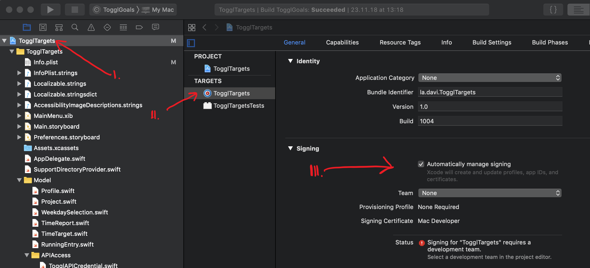

## What is TogglTargets?

TogglTargets is a tool that lets you set time targets, that is, amounts of time you would like to work per week or per month, for any of the projects whose time you are tracking on [Toggl](https://toggl.com), and can help you keep track of how you are doing at any point.

## Which problem does it try to solve?

There is a class of difficulty that I experience and you may be familiar with. It happens when juggling one and two things you do with a third and fourth things you also want to do, and it is the ease with which you can get carried away and lose track of how you’re doing on each of your open fronts. For your friendly coder in particular, it is not difficult to erroneously believe I have not done enough of one thing for today even when having the presence of mind to zoom out enough would reveal to me that indeed I have. The opposite problem also happens, namely the de facto abandonment of something I don’t want to abandone, be it because of the initial resistance that is sometimes inevitable before something becomes rewarding, or because I’ve been focusing disproportionately on another project. Which brings me to what happens the next time I work in the starved thing: I will try to compensate in the other direction by putting too much into it as if I had forgotten about the first one. It’s a lot like our intuitive (and blunt, and primitive) way of keeping balance on a tight rope if we are not trained to do it!

...

Of course, the question about how you are doing in each of your pursuits cannot be answered by just how much time you are investing in each of them. But comparing the time you have planned to invest in something versus the time you actually are spending on it can help you detect when you are losing balance by starving a project from attention, maybe even avoiding it, or conversely focusing on it too much at the expense of everything else.

If one or more of those things you work on is for a client and you have committed to a number of hours of work per week or per month, then you may consider it especially important that you get the times right at the beginning of the period so that you don’t find yourself having to catch up at the end in a way that discombobulates any momentum you might have gathered with the rest of what matters to you.

I trust that by this point you get the idea. Maybe you even say “That sounds like me! I thought I was alone! Thank you, dear stranger!”

### How did it come to exist?

I put it together to scratch three itches of my own: I’ve wanted to write a Mac app since before the Mac was cool (by which I actually mean back when the Mac was cool), I wanted to experiment with functional reactive programming (or something that is close enough for some practical purposes) and I wanted to be able to do enough freelance work for my clients and meet my targets of commitment to them while at the same time balancing my other endeavors, such as working on my own little projects (of which TogglTargets is the first one I dare to ship), practicing piano for about 20 hours a week, learning things I need and want to learn, and generally exploring.

## Reactive

I wrote above that I wanted to scratch three itches of my own. I hope that if you share some variation of my third itch you will find value in making use of TogglTargets. Now, if you share my second itch (ambitions related to the quasi functional reactive goodness) you might deem TogglTargets’ source code worth peeking through. The framework you’ll see in use if you do is Reactive Swift / Reactive Cocoa. When I started I wished there were more examples around of how to do some mundane things and I could not find enough variety in what already was available. So if you’re in a similar place to where I was back then, I hope having this as one more reference among the pool of resources will be useful. 

### About the approach chosen to implement TogglTargets' view controllers

TogglTargets’ view controllers try to stay simple and focused by having complex controllers be composed from simpler ones. The model is for the most part housekept outside of the view controllers, and each of them defines an interface that their containing controllers, all the way up to the application delegate, can bind to. Most interface types are composed of inputs and outputs and the connection to the interface is itself a value, so even though view controllers expect a single interface connection during their lifetime they are prepared to ensure that only the latest one is effective for both their inputs and outputs.

One quirk with the way this composition approach is implemented is that outer view controllers need to have knowledge of the inner view controllers’ inputs and outputs and declare those inputs and outputs as part of their own interface, even if they don’t make any use of those inputs and outputs themselves. A consequence of this is that adding an input or output to an inner view controller will in many cases force you to add it to every controller up the chain all the way through the entity that can produce or consume the relevant value, which could feel like writing unnecessary boilerplate. 

The reason to leave it like this for now is that, arguably, knowledge about the inputs and outputs of the contained view controllers is knowledge about their responsibilities and, as such, part of the container controller’s domain of interest. 

If this became too cumbersome, a different approach could be to have a single entity keep knowledge of all view controllers and have it be in charge of connecting each controller’s interface as needed. One version of this would  be a controller factory combined with controller injection which would preclude the use of storyboards. (which could be a feature, not a bug!) Another possibility would be to have this know-it-all coordinator traverse the controller tree each time there’s a change in it. Yet another would be to use view models for each view controller and assign the right view model to each controller by traversing the controller tree. Pick your poison!

## Building and running

### Retrieving and building dependencies

TogglTargets depends on the [ReactiveSwift](https://github.com/ReactiveCocoa/ReactiveSwift), [ReactiveCocoa](https://github.com/ReactiveCocoa/ReactiveCocoa), [Result](https://github.com/antitypical/Result) and [SQLite.swift](https://github.com/stephencelis/SQLite.swift) third party frameworks. The project is set up to use [Carthage](https://github.com/Carthage/Carthage) to manage these dependencies. Its [Cartfile](https://github.com/Carthage/Carthage/blob/master/Documentation/Artifacts.md#cartfile) declares the two "first-order" dependencies, ReactiveCocoa and SQLite.swift, and the other two are retrieved as sub-dependencies of ReactiveCocoa and ReactiveSwift.

To retrieve and build the dependencies make sure you have [Carthage installed](https://github.com/Carthage/Carthage#installing-carthage), change to the TogglTargets root folder from your shell of choice and run

```sh
carthage update --platform macOS
```
### Running from Xcode

1. Use your Xcode to open `TogglTargets.xcodeproj`
1. Manage the signing configuration:
    1. From within Xcode's project navigator select the `TogglTargets` project (the root element of the project tree)
    1. Select the `TogglTargets` target
    1. Make sure the `Signing` configuration in the `General` tab looks sound. One possibility is to leave `Automatically manage signing` checked and to select your developer team from the `Team` pop up menu.

    
1. Hit Play and play!

## Contributing

Contributions are most definitely most welcome.

## TODO

All todos. Today extension. iOS. Framework. 

There’s a case to be made that the icon is ghastly. If you’re about to make that case, be aware that I might mistake you for somebody with design skills and insist you provide a replacement. 

My Spanish translation is poor, it main purpose being as a placeholder to prove that localization will work. It’s somewhat ironic and strange since Spanish is my first language. We could have a long conversation about this because it’s complicated. Just please not in Spanish. 

## Reaching in

david@davi.la
