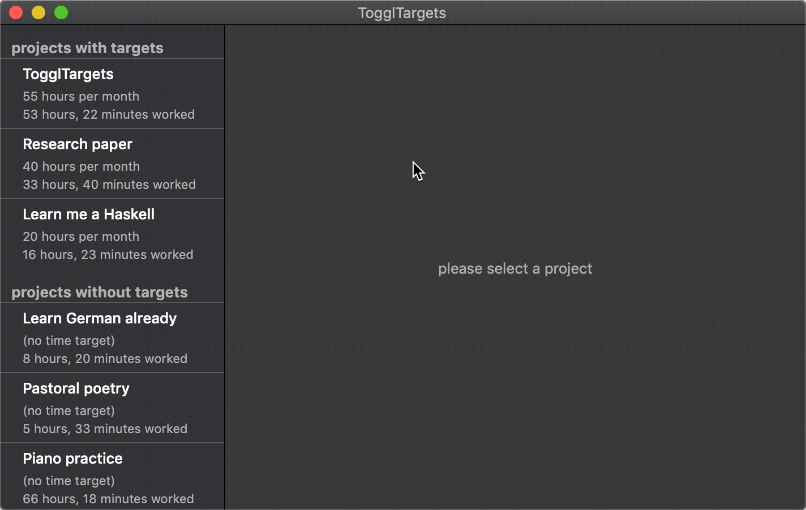
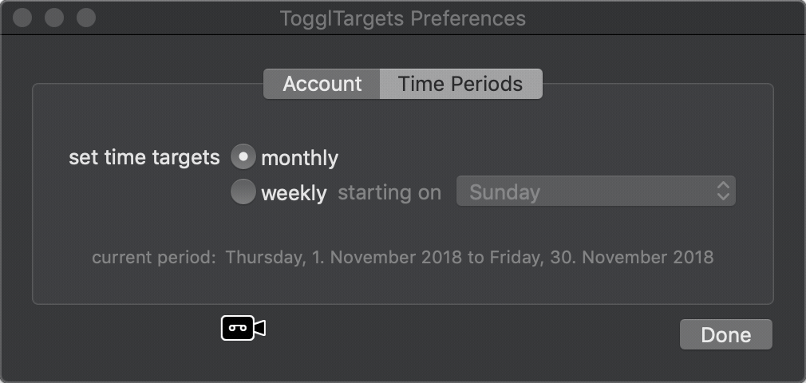

## What is TogglTargets?

TogglTargets is a Mac app that lets you set time targets, that is, amounts of time you would like to work per week or per month, for any of the projects whose time you are tracking on [Toggl](https://toggl.com), as well as selecting which days of the week you plan to wok on each of them, and can help you keep track of how you are doing at any point.



## Which problem does it try to solve?

There is a class of difficulty that I experience and you may be familiar with. It happens when juggling one and two things you do with a third and fourth things you _also_ want to do, and it is the ease with which you can get carried away and lose track of how you’re doing on each of your open fronts. For your friendly coder in particular, it is not difficult to erroneously believe I have not done enough of one thing for today even when having the presence of mind to zoom out sufficiently would reveal to me that indeed I have. The opposite problem also happens, namely the de facto abandonment of something I don’t want to abandone, be it because of the initial resistance that is sometimes inevitable before something becomes rewarding, or because I’ve been focusing disproportionately on another project. Which brings me to what happens the next time I work in the starved thing: I will try to compensate in the other direction by putting too much into it as if I had forgotten about the first one. It’s a lot like our intuitive (and blunt, and primitive) way of keeping balance on a tight rope if we are not trained to do it!

Of course, the question about how you are doing in each of your pursuits cannot be answered by just how much time you are investing in each of them. But comparing the time you have planned to invest in something versus the time you actually are spending on it can help you detect when you are losing balance by starving a project from attention, maybe even avoiding it, or conversely by focusing on it too much at the expense of everything else.

If one or more of those things you work on is for a client and you have committed to a number of hours of work per week or per month, then you may consider it especially important that you get the times right at the beginning of the period so that you don’t find yourself having to catch up at the end in a way that discombobulates any momentum you might have gathered with the rest of what matters to you.

I trust that by this point you get the idea. Maybe you even want to say “That sounds like me! I thought I was alone!”



### How did it come to exist?

I put it together to scratch three itches of my own: I’ve wanted to write a Mac app since before the Mac was too cool for school (some of us might say [_back when it really was_](https://mjtsai.com/blog/2016/11/16/)), I wanted to experiment with functional reactive programming (or something that is close enough for some practical purposes) and I wanted to be able to do enough freelance work for my clients and meet my targets of commitment to them while at the same time balancing my other endeavors, such as working on my own little projects (of which TogglTargets is the first one I dare to ship), practicing piano for enough hours per week, learning things I needed and wanted to learn, and generally exploring.

## Reactive

Speaking about having wanted to scratch three itches of my own, I hope that if you share some variation of my third itch you will find value in making use of TogglTargets. Now, if you share my second itch (ambitions related to the quasi functional reactive goodness) you might deem TogglTargets’ source code worth peeking through. The framework you’ll see in use if you do is Reactive Swift / Reactive Cocoa. When I started I wished there were more examples around of how to do some mundane things and I could not find enough variety in what already was available. So if you’re in a similar place to where I was back then, I hope having this as one more reference among the pool of resources will be useful.

## Getting TogglTargets

### Downloading a disk image for the current release

Get it from [here](https://davi.la/targets/release/TogglTargets.dmg).

### Using Homebrew Cask against a private script

This is a first release, so it would [not be a good idea](https://github.com/Homebrew/homebrew-cask/pull/28103) to submit a formula to the [Cask](https://github.com/Homebrew/homebrew-cask) repository. However, if you have [homebrew](https://brew.sh) installed in your system and you can install the latest release very quickly by `brew cask`ing the installation script directly like this:

```sh
brew cask install https://davi.la/toggltargets.rb
```

This will also let you `update` and (should you be so inclined) `uninstall` and `zap` the app in a breeze:

```sh
brew cask uninstall https://davi.la/toggltargets.rb
```
or (this will move your preferences and time targets database to the trash and leave no traces of the app elsewhere in your system):

```sh
brew cask zap https://davi.la/toggltargets.rb
```

If you want to build and run TogglTargets from source, read on.

### Building and running from code

#### Dependencies

TogglTargets depends on the [ReactiveCocoa](https://github.com/ReactiveCocoa/ReactiveCocoa) and [SQLite.swift](https://github.com/stephencelis/SQLite.swift) packages. The project is set up to use the Swift Package Manager to manage these dependencies. Xcode should be able to fetch them for you when you open the project.

#### Running from Xcode

1. Use your Xcode to open `TogglTargets.xcodeproj`
2. Manage the signing configuration:
    1. From within Xcode's project navigator select the `TogglTargets` project (the root element of the project tree)
    2. Select the `TogglTargets` target
    3. Make sure your `Signing` configuration looks sound.
3. You're ready to go.

## Contributing

Contributions are most definitely most welcome.

## What is next (and what would be nice to have)

In no particular order and certainly non-exclusively:

* A [Today widget](https://developer.apple.com/library/archive/documentation/General/Conceptual/ExtensibilityPG/Today.html#//apple_ref/doc/uid/TP40014214-CH11-SW1) which:
    * lists projects you should be working on today,
    * shows how much you should be working on each one,
    * visualizes how much you have worked on each,
    * summarizes the total work time target for today (and acknowledges whether it seems feasible).
* A command line interface tool.
* A field to filter projects by name or a quick "jump to project" command.
* Enriching the projects list with each project's target status.
* A way of visualizing time reports vs. your daily baseline.
* Notifications
    * when the target time for a period is reached for a given project,
    * when today's baseline is reached for a given project,
    * when today's baseline is reached for all projects for which today is a working day.

## General improvements I'm the most aware of:

There’s a case to be made that the visual design is all but bland. If you’re about to make that case, be aware that I might mistake you for somebody with design skills and insist you help me out.

My Spanish translation is rather poor, it main purpose being as a placeholder to prove that localization will work. It’s somewhat ironic and strange since Spanish is my first language. We could have a long conversation about this because it’s complicated (just please not in Spanish.)

## Say hello

david@davi.la
